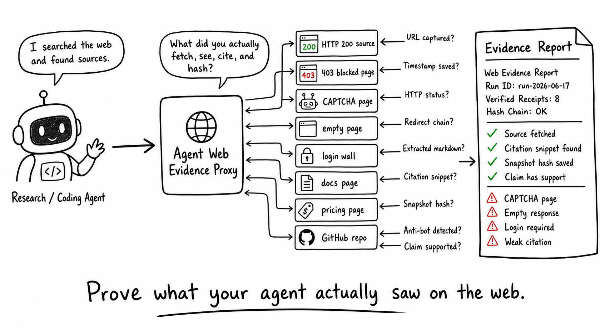

# Agent Web Evidence Proxy

[](https://github.com/xliry/Agent-Web-Evindence-Proxy/actions/workflows/ci.yml)

Local evidence receipts for AI agent web research.



Agent Web Evidence Proxy is a local-first CLI and lightweight HTTP API that proves what your agent actually saw on the web. Agents route web/search/scrape fetches through the mediator, and AWEP records inspectable, hash-chained receipts for every source.

It captures the URL, timestamp, HTTP status, redirects, extracted Markdown/text, page-quality warnings, source snippets, content hashes, and optional claim-to-source evidence status. The result is a human-readable Markdown evidence report plus a machine-readable JSON bundle that can be verified later.

Use it when an AI agent says "I searched the web" and you need to review what was actually fetched, whether the page was readable, and whether the cited source really contains evidence related to the claim.

## What It Does

- Fetches one URL through a local mediator.
- Captures status, redirects, hashes, extracted text, and page-quality flags.
- Maps optional claims to source snippets with deterministic heuristics.
- Writes Markdown and JSON evidence reports.
- Verifies hash-chained receipts.

## What It Does Not Do

- It does not prove truth.
- It does not bypass anti-bot systems.
- It does not automate a browser or execute JavaScript.
- It does not crawl the web.
- It does not provide a UI, dashboard, or HTML report in v0.
- It does not send telemetry.

## Quickstart

Package status: not published to PyPI yet.

Install from local source:

```bash
python -m pip install -e ".[dev]"
awep fetch https://example.com --claim "Example Domain is used for illustrative examples"
awep report latest
awep verify latest
```

Once published:

```bash
python -m pip install agent-web-evidence-proxy
```

Evidence is written under `.awep/runs/<run-id>/`.

## Agent Integration

Replace direct web fetches with:

```bash
awep fetch "$URL" --claim "$CLAIM" --run-id "$RUN_ID" --agent-id "$AGENT_ID" --tool-name "$TOOL_NAME"
```

Or run the local API:

```bash
awep serve --port 8787
```

The API binds to `127.0.0.1` by default.

Then call:

```http
POST http://127.0.0.1:8787/v1/fetch
```

PowerShell example:

```powershell
$body = @{
  url = "https://example.com"
  claim = "Example Domain is used for illustrative examples"
  agent_id = "codex"
  tool_name = "web.run"
} | ConvertTo-Json -Compress

Invoke-RestMethod `
  -Uri "http://127.0.0.1:8787/v1/fetch" `
  -Method Post `
  -ContentType "application/json" `
  -Body $body
```

## API Endpoints

- `GET /healthz`
- `POST /v1/fetch`
- `GET /v1/runs`
- `GET /v1/runs/{run_id}/report.md`
- `POST /v1/runs/{run_id}/report`
- `GET /v1/runs/{run_id}/evidence.json`
- `GET /v1/runs/{run_id}/verify`
- `POST /v1/runs/{run_id}/verify`

## Evidence Statuses

Source quality statuses are `ok`, `blocked`, `empty`, `login_required`, `js_required`, and `error`.

Claim evidence statuses are `supported`, `weak`, `missing`, `blocked`, `empty`, and `error`. They describe evidence quality, not truth. A `supported` label means the fetched text resembles the claim; it does not prove the claim is true.

## Security

The fetcher blocks localhost, loopback, private IP ranges, link-local addresses, metadata service addresses, non-HTTP schemes, and file URLs by default. Use `--allow-private` only for explicit local testing.

Receipts redact sensitive query parameters and do not store raw HTML by default. Authorization, cookie, API key, and proxy authorization headers are treated as secrets.

## Release

See [docs/release-checklist.md](docs/release-checklist.md). PyPI publishing is manual until explicitly approved.

## Roadmap

- MCP server mode.
- Optional browser snapshot adapter.
- Optional signed receipts.
- WARC-lite export.
- Vertical citation validators.
